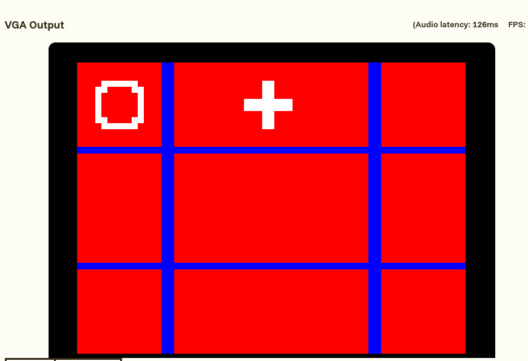
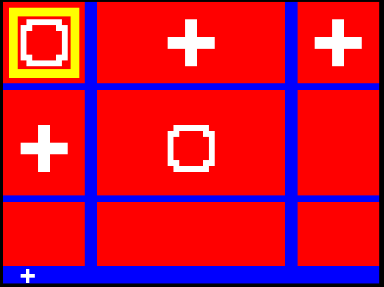
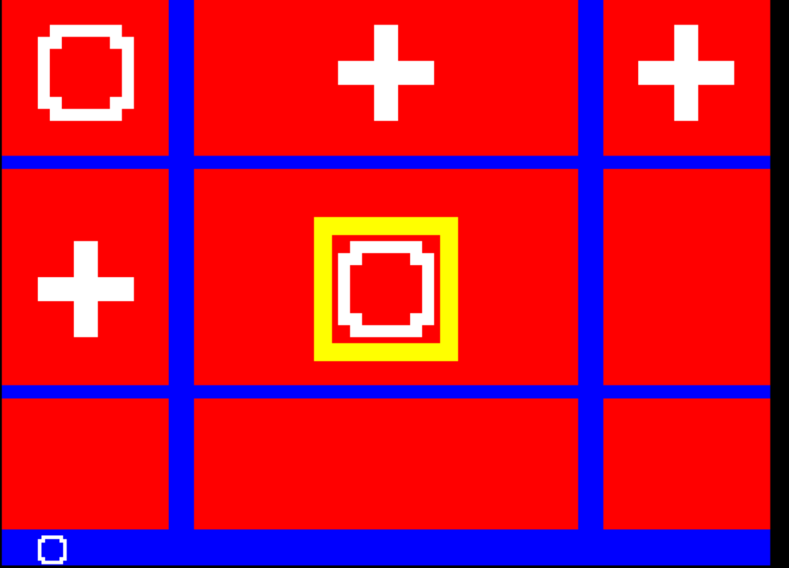
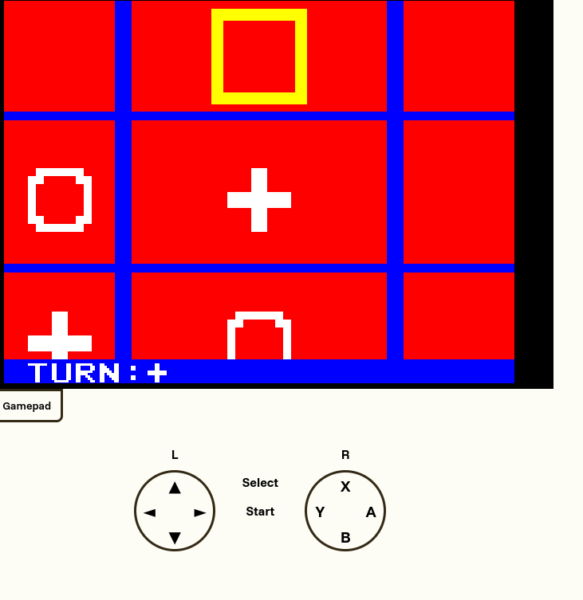
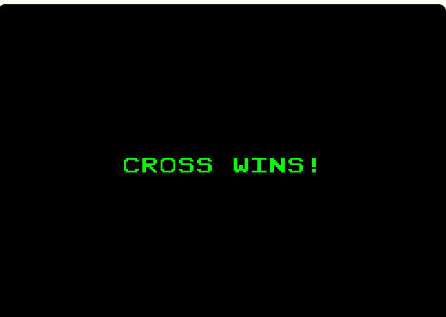

# Day 1
## Initial bootstrapping of the project
This was my first time making any game ( I'm not much of a game dev), let alone one in verilog so it was a bit of a new experience to me. I started off by attempting to initialize the basic grid the game would be played with, alongside with game state and character rendering. I yoinked the glyph_active function from the example Gamepad code and messed around with the sizing to get it to look good. One major problem i had here was that i was going like this

`Render at Position( x, y)`

vs. the VGA Method of

`if at Position(x ,y) Render`

Sounds like a small difference, but **it is very much not**. the method i used ended up causing an absolute mess of overwriting displays and if conditions, which i ended up simplifying to a much more elegant one liner. I also begun on the application state which was done using two 9 bit vectors (9 combinations) that looked like this

`reg [9:0] state //stores whether or not anything has been placed`

`reg [9:0] positions //stores what piece has been placed (to be used with state)`

(maybe i could try using a nested vector? hmmm)
Output: (Fully dynamic, controlled through above vectors)

Time Spent :- 1.5 Hours

# Day 2 (& Technically 3?)
> i did an all nighter lolol
## Major refactors of the code, QoL features and input!
I started off by fixing the code. Before, i was manually setting up each glyph to be rendered, and then using that variable to render it
(**STUPID**)
instead, i used Verilog's handy generate function to automatically generate a vector with each glyph to be drawn continously, which was ~~later~~ rendered then (must think like fpga man)
this allowed me to significantly cut down on the code required. I also modified the glpyh_active function to take a specific scale value (used later).
````
generate
  for (i=0; i<9; i=i+1) begin : CELL_DRAW
    localparam integer row = i / 3;
    localparam integer col = i % 3;
    wire glyph_on;
    assign glyph_on = glyph_active(
        GRID_ORIGIN_X + col*CELL_SPACING,
        GRID_ORIGIN_Y + row*CELL_SPACING_Y,
        state[i] ? (placed[i] ? Circle : Cross) : Blank, 10
    );
    assign cell_active[i] = glyph_on;
  end
endgenerate
````
I then began work on the turn indicator. I first initialized a bottom indicator panel, and then setup a drastically scaled down 
piece glyph for the current turn. I then attempted to make it trigger off an input, where i ran into the first error.
The lowest level of programming i've written (that matches this condition) was using ESP-IDF to detect button presses, which was fairly straigtforward.
sticking that logic here, caused issues, however as that was registered as a single long HIGH signal. After extensive research (5 minutes of googling), i realised the solution was to 
listen to the rising edge of the input, and use that. I made another generator, to create a vector with the button presses of every single input we got.

Output:



Output 2:

(Notice changed piece (bottom-left) and selector)

Time Spent :- 2 Hours

# Day 3
Time Spent :- 1.5 Hour
well good news. it works. bad news. it barely works. I setup two keybinds in order to both change position and 
update the current if empty and dependant on turn. The problem came when i found out only !TWO! keybinds were registering.
caveman no understand :(. i debugged for an half hour and wasn't able to get any progress on the button issue. I also got text rendering going on the bottom bar    

# Day 4
well contrary to all expectations, and leaving me still confused, the generation of the buttons was **NOT**
according to the btn_in array or even anything close.
```Haskell
generate
  for (c = 0; c < 11; c = c+1) begin : BUTTON_POPULATE
    assign btn_pressed[c] = btn_in[c] & ~last_btn[c];
  end
endgenerate

```

Instead i spent half an hour manually testing each button. (kindly point me to the person who decided
inputs should only be registered when the gamepad tab is open), and created my own mapping of number to button
(10 is still unknown tho). After that, i wrote a quick function to find the HIGH in selected, to check the current square
```eleventy
function [3:0] high_index;
    input [8:0] select;
    begin
      integer i;
      high_index = -1;
      for (i = 0; i < 9; i = i +1) begin
        if (select[i]) begin
          high_index = i;
        end
    end
    end
    endfunction
```
I then setup proper block placing, and a reset button. This removed the need to manually edit the array for adding new stuff.
To finish off the user-side, i populated all four arrow keys and spent a bit of time in making combinational logic to scroll around

time spent: 2.5 Hours


# Day 5 (I kinda lost track)
Since most things were done, i begun work on the actual win detection of it. It took me quite a bit of time due to one dumb mistake i was making

```floobits
 a == b == c
```
this was wrong, as it first compared a to b, and then compared the result to c. It took my small brain some time to fix this, despite realising the error
fairly quickly (i even wrote it down in a comment). I then made a quick circle and cross win screen, which was ridiculously unoptimized.
Then i tried to optimise it, and  proceeded to completely break it :(. After that i made a few more small fixes to rendering, such as fixing offscreen 
text

Time Spent: 2.5 Hours

# Day 6
I began work on ReRender Pro Enterprise (aka not being dumb). Instead of creating a unique glyph for every